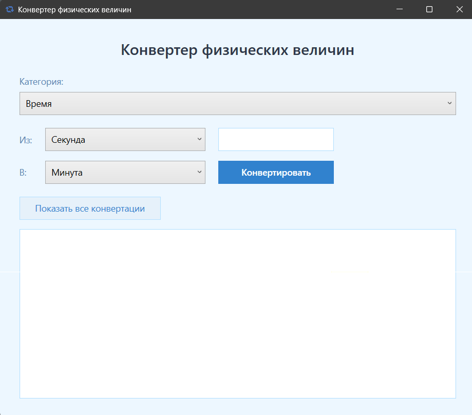

# Конвертер физических величин



## Описание
Интерактивное приложение с графическим пользовательским интерфейсом для конвертации физических величин. Разработано в рамках курсовой работы по дисциплине "Информационные технологии и программирование".

## Функциональные возможности
- Поддержка 5 категорий физических величин:
  - Длина (метры, сантиметры, километры, дюймы, футы)
  - Масса (граммы, килограммы, тонны, унции, фунты)
  - Время (секунды, минуты, часы, дни, недели)
  - Температура (Цельсий, Фаренгейт, Кельвин)
  - Скорость (м/с, км/ч, мили/ч, узлы, футы/с)
- Два режима конвертации:
  - Конвертация в выбранную единицу измерения
  - Конвертация во все возможные единицы измерения
- Интуитивно понятный графический интерфейс
- Обработка ошибок ввода с кастомными диалоговыми окнами
- Поддержка горячей клавиши Enter для конвертации

## Требования к системе
- Windows 10/11
- .NET 8.0
- 100 МБ свободного места на диске

## Сборка и запуск
1. Клонируйте репозиторий:
   ```bash
   git clone https://github.com/ваш-логин/UnitConverter.git
2. Перейдите в папку проекта:
   ```bash
   cd UnitConverter
3. Соберите проект:
   ```bash
   dotnet build
3. Запустите приложение:
   ```bash
   dotnet run

## Структура проекта
UnitConverter/
├── UnitConverter.csproj           # Файл проекта
├── App.xaml                       # Корневой XAML файл приложения
├── App.xaml.cs                    # Логика приложения
├── MainWindow.xaml                # Главное окно приложения
├── MainWindow.xaml.cs             # Логика главного окна
├── CustomMessageBox.xaml          # Кастомное диалоговое окно
├── CustomMessageBox.xaml.cs       # Логика диалогового окна
├── Unit.cs                        # Базовый класс и реализации единиц измерения
├── ConversionService.cs           # Сервис конвертации
├── app_icon2.ico                  # Иконка приложения
└── screenshot.png                 # Скриншот программы